# <h1 align="center">**PROYECTO FINAL: YELP & GOOGLE MAPS - REVIEWS AND RECOMMENDATIONS**</h1>

  
# <h2 align="center"><b><i>:small_orange_diamond:**ALCANCES DEL PROYECTO**</i></b></h2>

Este proyecto consiste en analizar el mercado estadounidense referido a restaurantes y afines, desarrollando el rol de una empresa consultora de datos, mediante la utilización y extracción de los mismos de las fuentes de Yelp y Google Maps.

Se analizarán los restaurantes en el estado de Florida, entre los años 2017-2022.

 
Se busca impactar tanto a empresarios como a clientes al proporcionar información valiosa sobre la percepción de la ronda de inversores y brindar recomendaciones personalizadas. Esto permitirá a los empresarios tomar decisiones estratégicas informadas y mejorar la experiencia del cliente. Con datos limpios, análisis exploratorio, modelos de machine learning y un dashboard interactivo, se optimizará la toma de decisiones, la experiencia del cliente y la relación entre ambas partes. Por lo tanto, se creará un modelo de machine learning basado en procesamiento de lenguaje natural (NLP) que analice las reseñas, las califique como buenas o malas, así como las preferencias del cliente para hacer recomendaciones a los negocios sobre las oportunidades de mejora.

 
El análisis de los datos será enfocado en explicar la percepción que tienen los usuarios sobre los restaurantes, haciendo especial énfasis en evaluar la experiencia de consumo, calidad de servicio y oportunidades de mejora. 

# <h2 align="center"><b><i>:small_orange_diamond:**PLANTEAMIENTO DEL PROBLEMA**</i></b></h2>

Nuestro cliente es parte de empresas de restaurantes y afines, y desean tener un análisis detallado de la opinión de los usuarios en Yelp y cruzarlos con los de Google Maps sobre hoteles, restaurantes y otros negocios afines al turismo y ocio. Nuestra misión consiste en amplificar la visibilidad y la influencia de su negocio. Nos enfocamos en conectar de manera significativa con los comensales, quienes toman decisiones informadas basadas en las reseñas que descubren en plataformas como Yelp y Google. Nos esforzamos por potenciar la experiencia del cliente, asegurando que su negocio destaque y deje una impresión duradera en aquellos que buscan experiencias auténticas y satisfactorias.

# <h2 align="center"><b><i>:small_orange_diamond:**OBJETIVOS DEL PROYECTO**</i></b></h2>

Enfocamos nuestros esfuerzos en la construcción de una base de datos sólida destinada al análisis y modelado. Nuestro objetivo primordial es desarrollar un modelo avanzado de Machine Learning especializado en el análisis de sentimientos a partir de críticas, reseñas y opiniones de usuarios.
Posteriormente, creamos un reporte dinámico que proporciona una visión detallada de las tendencias del consumidor en el sector gastronómico. Este análisis exhaustivo permite identificar riesgos y oportunidades mediante un seguimiento continuo. Nuestro enfoque en KPIs (Indicadores Clave de Rendimiento) específicos asegura una evaluación precisa y eficiente de los resultados obtenidos.

# <h2 align="center"><b><i>:small_orange_diamond:**KPI'S**</i></b></h2>

 
Con la implementación del proyecto se busca poder cumplir los siguientes KPI's:

* 1- Índice de Satisfacción del Cliente (ISC):
Definición: El ISC mide el nivel de satisfacción general de los clientes con respecto a la experiencia en el restaurante.
Fórmula: ISC = (Suma de todas las calificaciones de satisfacción / Total de calificaciones) * 100
Métrica: Valor porcentual. Se busca obtener un valor promedio mayor al de la media de los últimos 3 meses para los restaurantes en el Estado correspondiente.
* 2- Tasa de Retención de Clientes:
Definición: La tasa de retención de clientes mide qué tan bien el restaurante está conservando a sus clientes existentes.
Fórmula: (Número de clientes al final del período - Nuevos clientes adquiridos durante el período) / Número de clientes al inicio del período * 100
Métrica: Porcentaje. Un alto índice indica que se logra retener a los clientes, lo cual es crucial para el éxito a largo plazo del restaurante.
* 3- Indicador de Reseñas Negativas:
Definición: Un índice que indica la proporción de reseñas negativas en comparación con las positivas.
Fórmula: (Número de reseñas negativas) / (Número total de reseñas)
Métrica: Rango de valores entre 0 (bueno) y 1 (malo). Se busca reducir las reseñas negativas mensuales del consumidor respecto a la competencia.
* 4- Tasa de Reservas Futuras:
Definición: La tasa de crecimiento en la cantidad de reservas de los restaurantes.
Fórmula: ((Reservas actuales - Reservas del mes anterior) / Reservas del mes anterior) * 100
Métrica: Porcentaje. Se busca aumentar la cantidad de reservas en un 5% respecto al mes anterior.

# <h2 align="center"><b><i>:small_orange_diamond:**SOLUCIÓN AL PROBLEMA**:</i></b></h2>

Nuestra propuesta de solución abarca la recopilación, el análisis y la interpretación sistemática de datos relevantes para obtener información valiosa y con ello proceder a la implementación de un modelo de análisis de sentimientos mediante procesamiento de lenguaje natural (NLP), diseñado para abordar los desafíos de la creciente competencia en la industria de restaurantes. Al incorporar este sistema, los restaurantes pueden elevar la satisfacción del cliente, tomar decisiones basadas en datos sólidos y consolidar su posición competitiva en el dinámico mercado gastronómico. Estamos comprometidos en brindar herramientas efectivas que permitan a los restaurantes no solo adaptarse a las demandas cambiantes, sino también destacar y prosperar en un entorno altamente competitivo.

# <h2 align="center"><b><i>:small_orange_diamond:**TECNOLOGÍAS A UTILIZAR**:</i></b></h2>
• Visual Studio Code
• Google Cloud
• Python
• Pandas
• Numpy
• Scikit-learn
• Matplotlib
• Seaborn
• Power Bi
• Jupyter
• Docker
• Github
• Streamlit
• Dataflow

# <h2 align="center"><b><i>:small_orange_diamond:**INTEGRANTES DEL EQUIPO**</i></b></h2>

  <a href="https://www.linkedin.com/in/nadirangelini/">Nadir Angelini</a>&nbsp;&nbsp;&nbsp;&nbsp;&nbsp;&nbsp;&nbsp;&nbsp;&nbsp;&nbsp;&nbsp;&nbsp;&nbsp;&nbsp;&nbsp;&nbsp;&nbsp;&nbsp;&nbsp;&nbsp;&nbsp;&nbsp;&nbsp;&nbsp;&nbsp;&nbsp;&nbsp;&nbsp;&nbsp;&nbsp;&nbsp;&nbsp;&nbsp;&nbsp;&nbsp;&nbsp;&nbsp;&nbsp;&nbsp;&nbsp;&nbsp;&nbsp;&nbsp;&nbsp;&nbsp;&nbsp;&nbsp;&nbsp;&nbsp;&nbsp;&nbsp;&nbsp;&nbsp;&nbsp;&nbsp;&nbsp;&nbsp;&nbsp;&nbsp;&nbsp;&nbsp;&nbsp;&nbsp;&nbsp;
  <a href="https://www.linkedin.com/in/german-daniel-gutierrez/">Germán Gutierrez</a>&nbsp;&nbsp;&nbsp;&nbsp;&nbsp;&nbsp;&nbsp;&nbsp;&nbsp;&nbsp;&nbsp;&nbsp;&nbsp;&nbsp;&nbsp;&nbsp;&nbsp;&nbsp;&nbsp;&nbsp;&nbsp;&nbsp;&nbsp;&nbsp;&nbsp;&nbsp;&nbsp;&nbsp;&nbsp;&nbsp;&nbsp;&nbsp;&nbsp;&nbsp;&nbsp;&nbsp;&nbsp;&nbsp;&nbsp;&nbsp;&nbsp;&nbsp;&nbsp;&nbsp;&nbsp;&nbsp;&nbsp;&nbsp;&nbsp;&nbsp;&nbsp;&nbsp;&nbsp;&nbsp;&nbsp;&nbsp;&nbsp;&nbsp;&nbsp;&nbsp;&nbsp;&nbsp;&nbsp;&nbsp;
  <a href="https://www.linkedin.com/in/leonel-viscay/">Leonel Viscay</a>&nbsp;&nbsp;&nbsp;&nbsp;&nbsp;&nbsp;&nbsp;&nbsp;&nbsp;&nbsp;&nbsp;&nbsp;&nbsp;&nbsp;&nbsp;&nbsp;&nbsp;&nbsp;&nbsp;&nbsp;&nbsp;&nbsp;&nbsp;&nbsp;&nbsp;&nbsp;&nbsp;&nbsp;&nbsp;&nbsp;&nbsp;&nbsp;&nbsp;&nbsp;&nbsp;&nbsp;&nbsp;&nbsp;&nbsp;&nbsp;&nbsp;&nbsp;&nbsp;&nbsp;&nbsp;&nbsp;&nbsp;&nbsp;&nbsp;&nbsp;&nbsp;&nbsp;&nbsp;&nbsp;&nbsp;&nbsp;&nbsp;&nbsp;&nbsp;&nbsp;&nbsp;&nbsp;&nbsp;&nbsp;
  <a href="http://www.linkedin.com/in/camila-fernandez-llaneza/">Camila Fernández Llaneza</a>

# <h2 align="center"><b><i>:small_orange_diamond:**DESARROLLO DEL PROYECTO**:</i></b></h2>
# <h3 align="center"><b><i>**Análisis preliminares - EDA's (Análisis Exploratorio de Datos)**:</i></b></h3>
Se ha realizado un [EDA_Preliminar](https://github.com/camillaneza/PF_Google_Yelp/blob/2612d0b025e0e13967f048128300c54cc9dfcba3/jupiter/EDA/EDA_Yelp.ipynb) que es la exploración de las diferentes fuentes de datos de Google Maps y Yelp. El propósito de estos análisis preliminares consiste en determinar qué datos serán funcionales para los objetivos propuestos anteriormente con el fin de hacer una limpieza y crear la arquitectura del Data Warehouse para la ejecución del proyecto.

# <h2 align="center"><b><i>:small_orange_diamond:**ARQUITECTURA**:</i></b></h2>

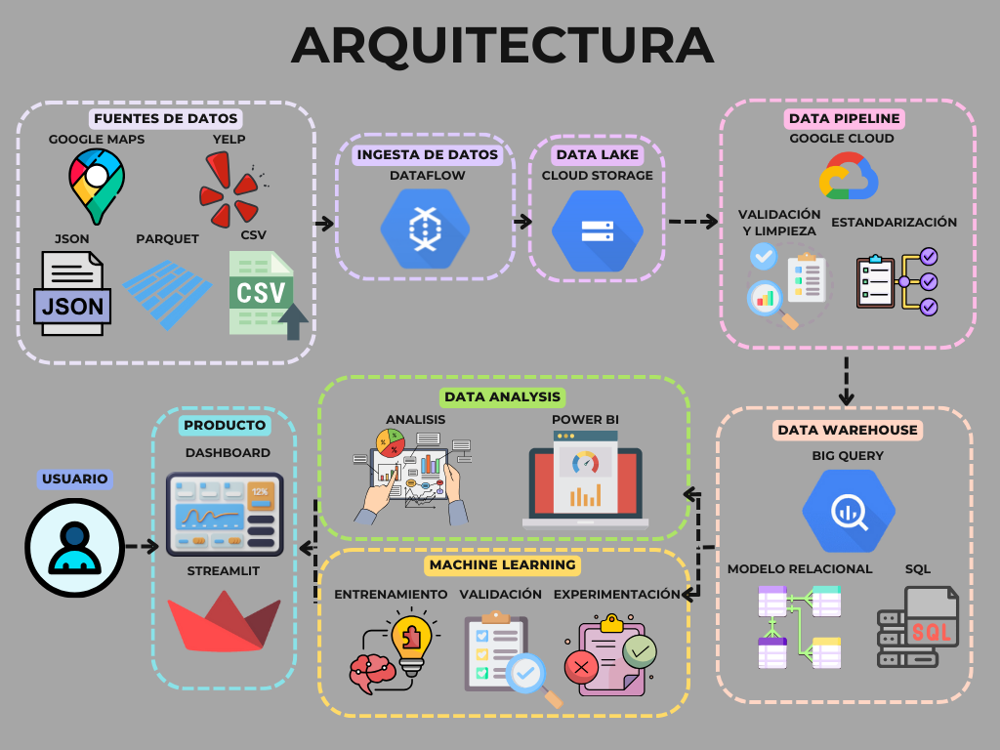

# <h2 align="center"><b><i>:small_orange_diamond:**DIAGRAMA ENTIDAD-RELACIÓN**:</i></b></h2>

# <h2 align="center"><b><i>:small_orange_diamond:**MODELOS DE MACHINE LEARNING**:</i></b></h2>

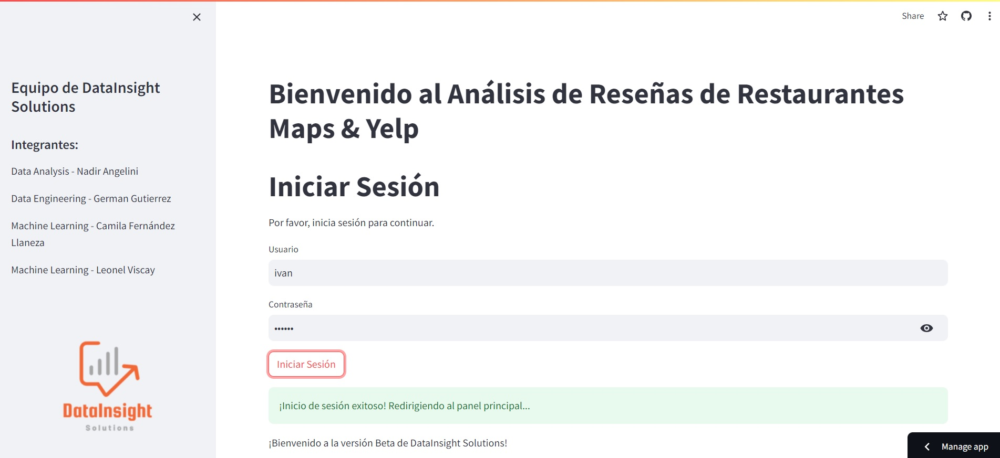

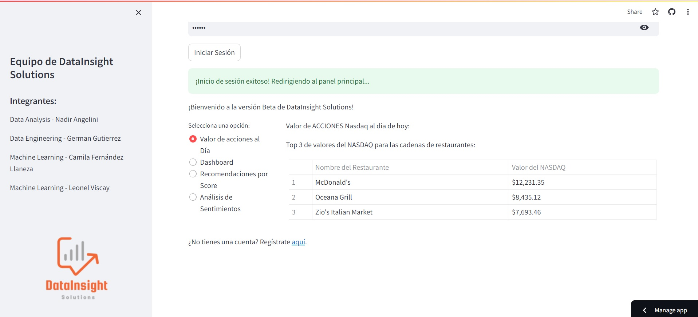

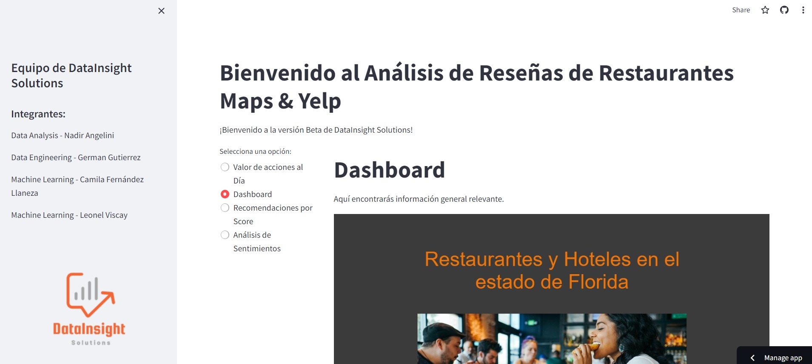

•[Modelos de Recomendación:](https://github.com/camillaneza/PF_Google_Yelp/blob/5eac6a014d1e4c59c4a2ffb024b2edc467901b74/jupiter/ML/Sistema_Recomendacion.ipynb) Se recomienda a los usuarios restaurantes similares a sus comportamientos de consumo.

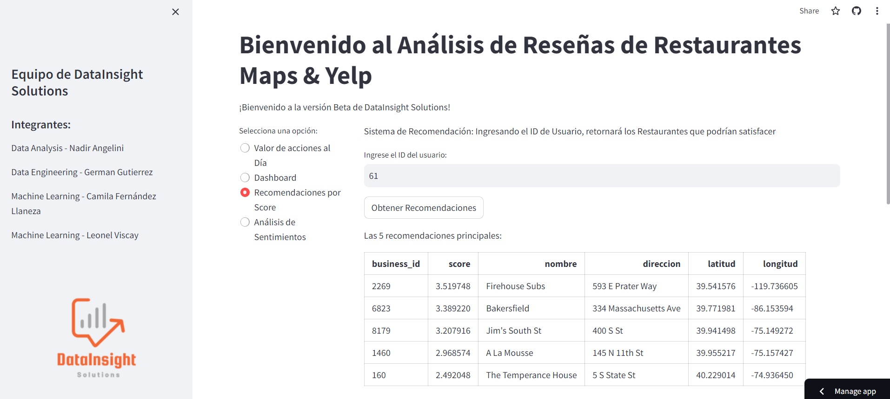

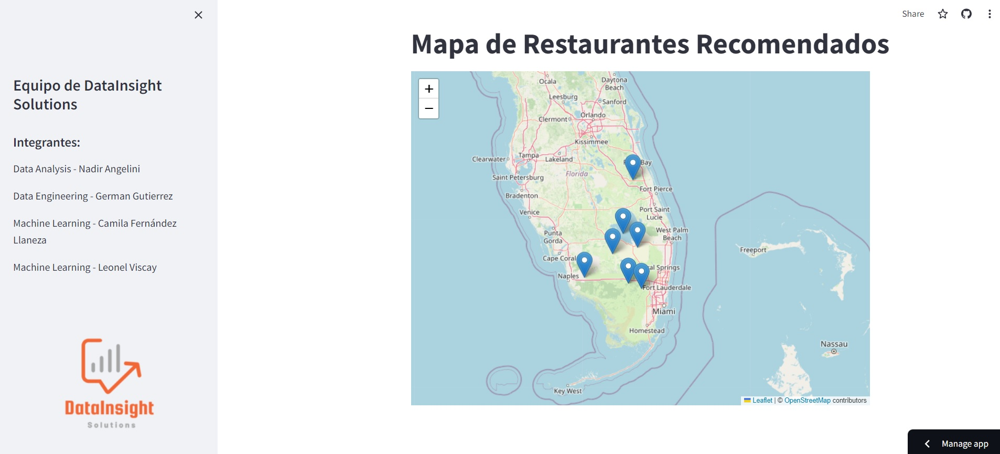

•[Análisis de Sentimiento:](https://github.com/camillaneza/PF_Google_Yelp/blob/5eac6a014d1e4c59c4a2ffb024b2edc467901b74/jupiter/ML/ML_AnalisisSentimientos.ipynb) Se clasifican los comentarios en bueno, neutro y malo.

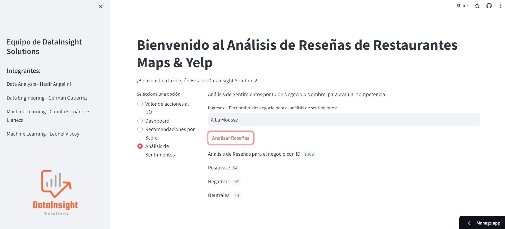

# <h2 align="center"><b><i>:small_orange_diamond:**DASHBOARD**:</i></b></h2>
Se realizó un Dashboard interactivo mostrando indicadores claves para las empresas así como los KPI's anteriormente mencionados para una mejora en la toma de decisiones en la implementación de estrategias.

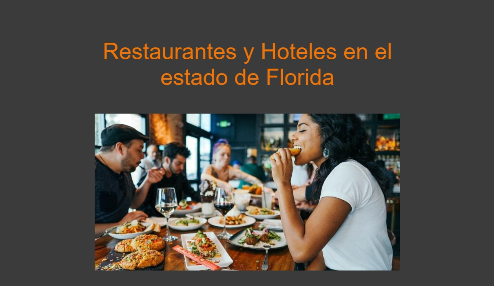

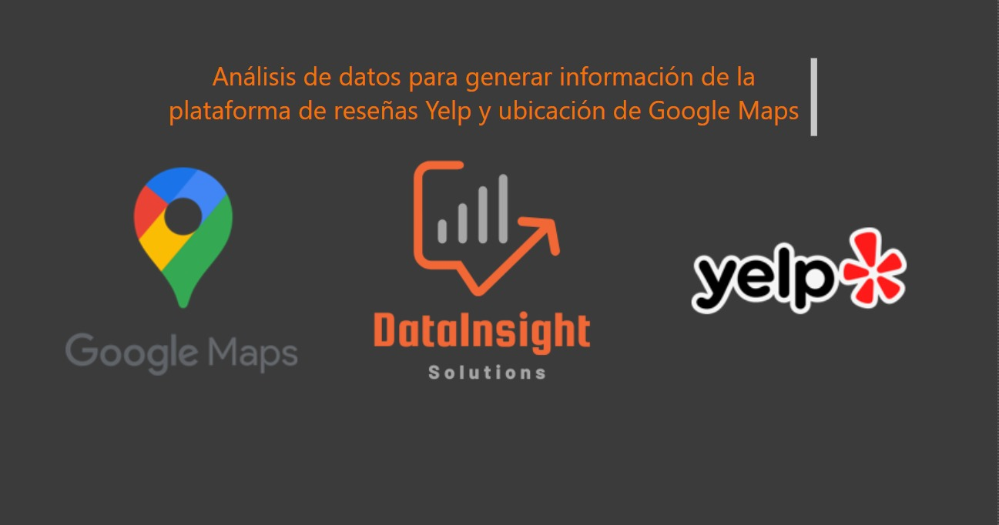

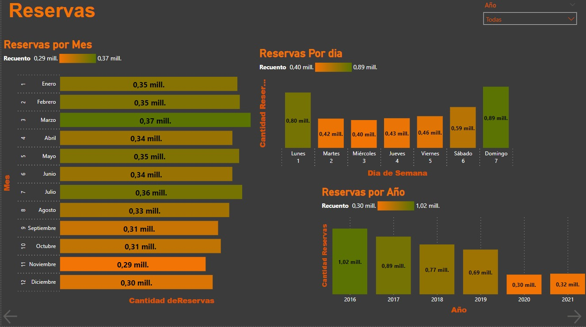

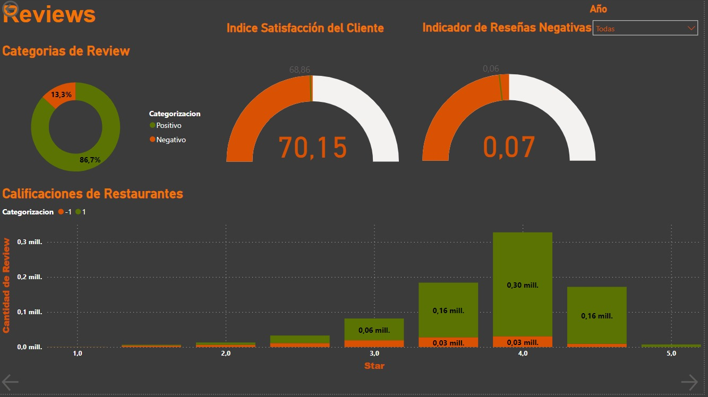

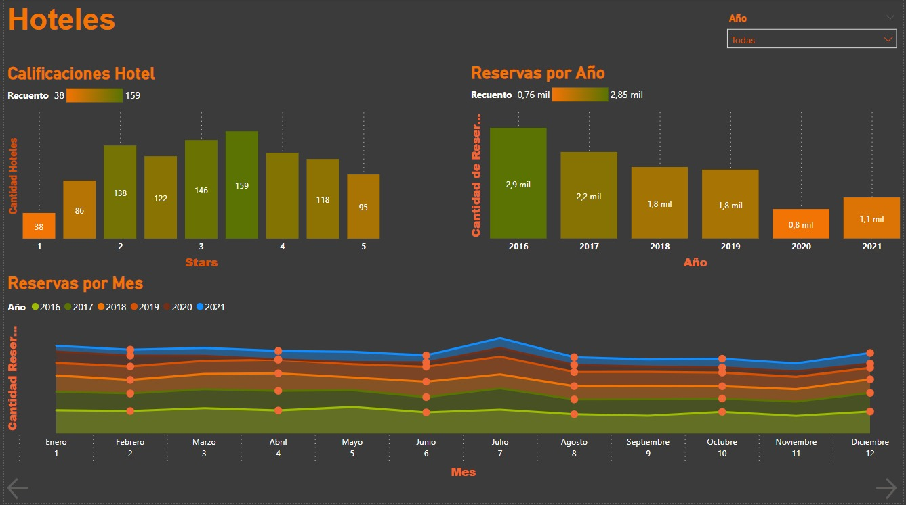

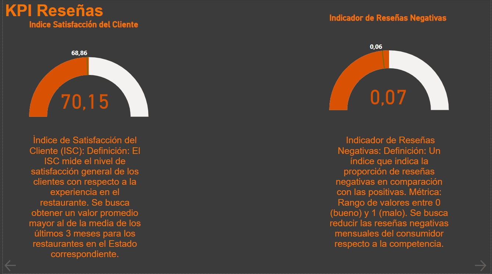

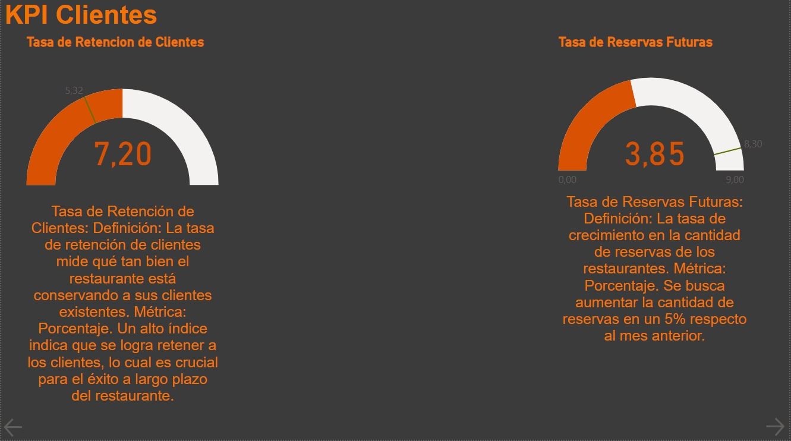

# <h2 align="center"><b><i>:small_orange_diamond:**DEPLOY**:</i></b></h2>

[Deploy Streamlit](https://dainsightsolutions.streamlit.app/)

# <h2 align="center"><b><i>:small_orange_diamond:**DOCUMENTACIÓN ADICIONAL**:</i></b></h2>

[Planificación](https://trello.com/b/oqMq7m68/pfgoogleyelp)

[Documentación: Propuesta del Proyecto](https://docs.google.com/document/d/1BgjR7BgYJHB1vxhq1U-IXXomBF3vnN7GtuaUTItTp38/edit)

